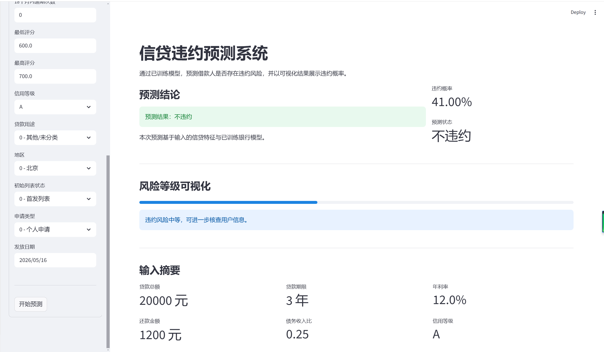

# 信贷违约预测系统

## 项目简介

本项目是一个用于信贷违约风险预测的端到端示例系统。包含数据生成/加载、特征预处理、模型训练、模型评估与模型持久化，适合作为风控模型原型或教学演示工程。

## 功能特点

- 一键生成合成信贷数据（或加载本地数据）。
- 支持数据预处理（缺失值处理、类别编码）。
- 同时训练随机森林和逻辑回归模型，并比较两者性能。
- 输出常用评估指标（准确率、AUC、分类报告）。
- 将最优模型持久化为 joblib 文件，支持离线加载预测。

## 模型评估结果

以下结果基于“北方某商业银行的信贷违约数据”的训练集与测试集评估：

| 模型 | 训练集准确率 | 训练集 AUC | 测试集准确率 | 测试集 AUC |
| ---- | ------------ | ---------- | ------------ | ---------- |
| 逻辑回归 | 0.8387 | 0.8500 | 0.8440 | 0.8617 |
| 随机森林 | 1.0000 | 1.0000 | 0.8520 | 0.8766 |

从这些指标可以看出：

- 随机森林在测试集上的准确率为 85.20%、AUC 为 0.8766，整体分类效果较好，但训练集上达到 100%，提示模型可能出现过拟合。
- 逻辑回归在测试集上的准确率为 84.40%、AUC 为 0.8617，训练集与测试集差距较小，泛化能力更稳健，但仍应关注样本不平衡对违约预测的影响。

这些指标的优缺点与风险点：

- 准确率：适合衡量总体预测正确率；但在违约样本占比较低时，准确率容易被多数类支配，从而掩盖对少数类违约样本的预测弱点。
- AUC：适合评估模型区分正负样本的能力，尤其是在不平衡样本场景下；但它并不直接反映特定阈值下的预测结果，需要结合具体业务阈值和成本分析使用。
- 训练集指标：用于判断模型拟合情况。训练集表现非常好且高于测试集，通常意味着模型可能记住了训练数据中的噪声或特殊模式。

常见陷阱：

- 类别不平衡：违约样本较少时，模型容易偏向多数类，从而降低对违约样本的召回率。
- 数据泄露：若特征包含未来信息或与目标高度相关的派生变量，评估结果会被高估。
- 过拟合：模型在训练集上表现过好，但在测试集上表现下降，说明模型可能对训练数据拟合过度。

过拟合缓解建议：

- 使用更多样本或扩充数据，避免训练数据过于狭窄。
- 采用交叉验证评估模型稳定性，避免单次数据划分带来的偶然性。
- 对逻辑回归使用正则化；对随机森林设置 `max_depth`、`min_samples_leaf`、`min_samples_split` 等参数，控制模型复杂度。
- 简化特征、去除与目标无关或噪声特征，降低模型方差。
- 对数值特征进行标准化/归一化，并结合特征选择或降维，提升模型稳健性。
- 根据业务需求调整决策阈值，结合召回率、精确率和成本敏感度衡量最终效果。

## Streamlit 应用界面

本项目可通过 `app.py` 启动 Streamlit 应用，展示输入特征、违约概率、风险等级可视化与预测结论。

<p align="center">
  
</p>

> 图示为应用界面预览，展示用户输入面板、预测结果摘要和风险等级可视化条。

推荐使用虚拟环境并通过 `requirements.txt` 安装依赖。

1. 创建并激活虚拟环境（Windows）：

```powershell
python -m venv venv
venv\Scripts\activate
```

2. 安装依赖：

```powershell
pip install -r requirements.txt
```

建议使用虚拟环境（如 `venv`）隔离依赖，避免不同项目间库版本冲突。

必要依赖（示例）：

- pandas
- numpy
- scikit-learn
- joblib
- streamlit (若使用演示页)

## 如何运行

训练并保存最优模型（若希望生成合成数据）：

```powershell
python src\main.py --train --generate-data
```

仅用已有数据训练：

```powershell
python src\main.py --train --data-path data/credit_default.csv
```

评估已保存模型：

```powershell
python src\main.py --evaluate --model-path model/joblib/model.joblib
```

运行 Streamlit 演示页（若包含 `app.py`）：

```powershell
streamlit run app.py
```

## 项目结构

- README.md — 项目说明（本文件）
- requirements.txt — Python 依赖列表
- data/ — 示例数据或用户数据（默认 data/credit_default.csv）
- model/joblib/ — 保存的模型（建议忽略上传大文件）
- src/main.py — 程序入口，包含训练/评估流程
- src/data.py — 数据生成与预处理逻辑
- src/model.py — 模型训练、评估与持久化
- app.py — Streamlit 演示应用（可选）

## 注意事项（关于 Git 推送）

生产环境下请避免将大文件或环境文件（如模型二进制、虚拟环境、临时缓存）提交到 Git。建议在仓库根添加 `.gitignore`，示例请参考 `.gitignore` 文件。

## 联系与许可

如需进一步改进（特征工程、模型调参、部署到云服务），欢迎发起 issue 或联系作者。

## 致谢

本项目数据集来源于和鲸社区，特别感谢和鲸社区提供的数据资源与知识分享平台。也感谢开源社区、项目贡献者和所有知识分享者对本项目的支持。
